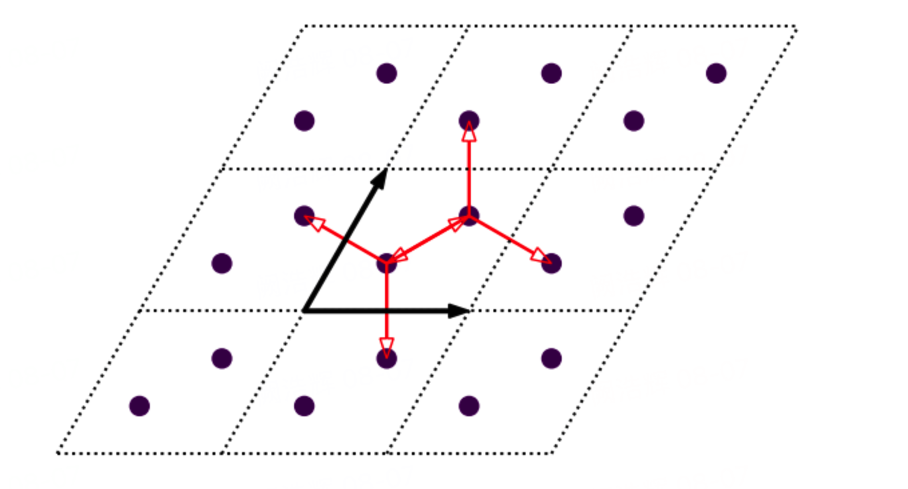
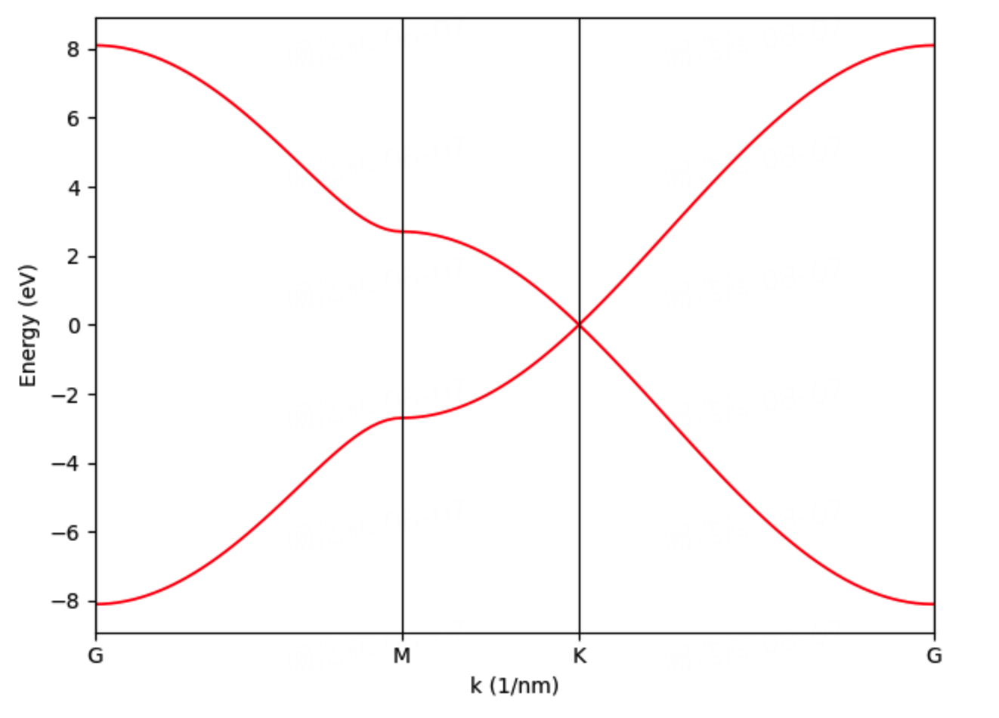
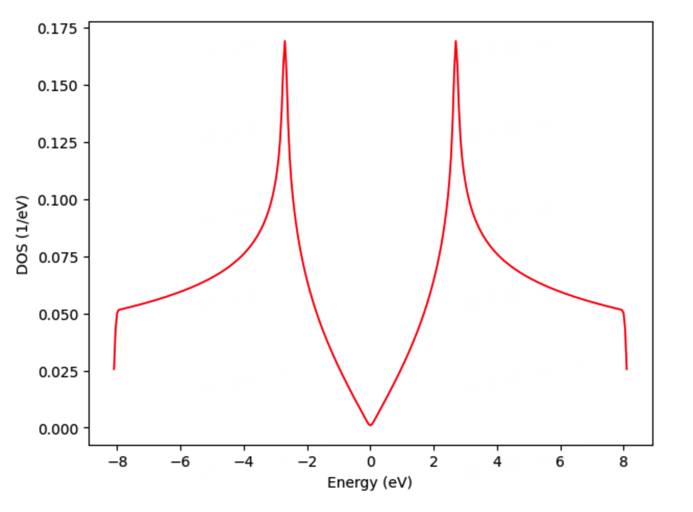
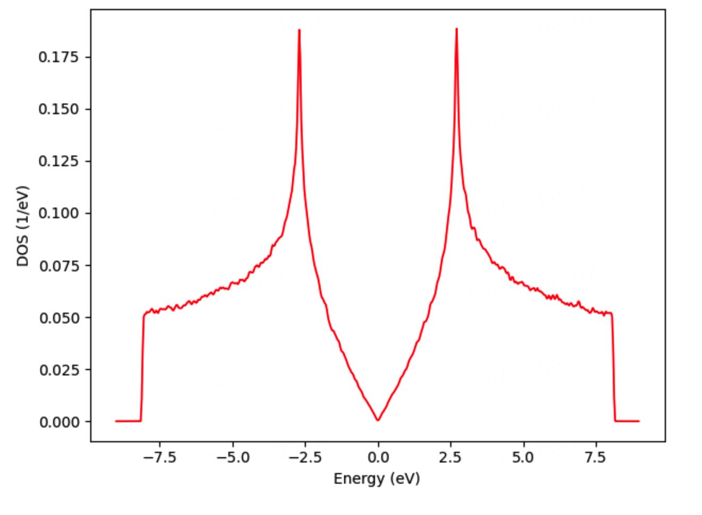
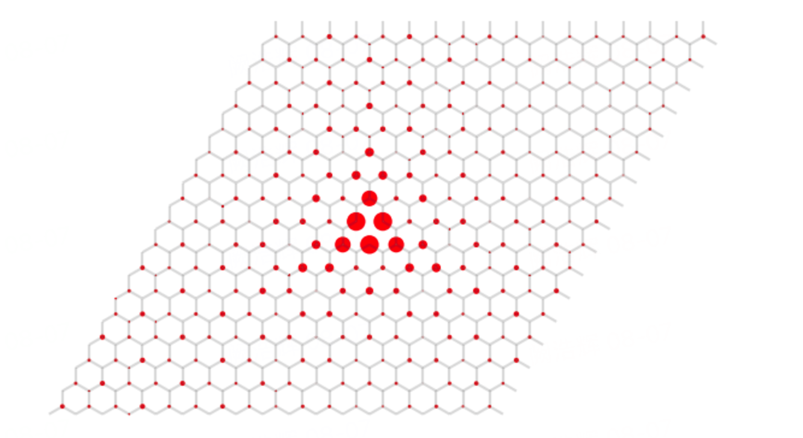
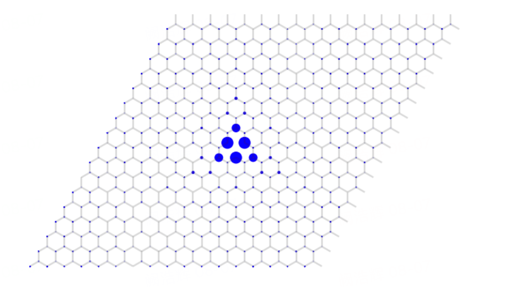

# TBPLaS入门教程

::: tip 作者｜李云海

本文搬运于：[Notebook 案例广场｜TBPLaS入门教程](https://nb.bohrium.dp.tech/detail/3814348275)

**你可以直接在上述网站运行或调试文章中的代码**

::: left
<a href="https://nb.bohrium.dp.tech/detail/3814348275" target="_blank"></a>

:::

## 目标

**学会使用TBPLaS构建和求解紧束缚模型**

在学习本教程后，你将能够：

+ 用TBPLaS构建原胞和超胞模型
+ 用精确对角化方法计算能带、态密度和本征态
+ 用TBPM方法计算态密度和准本征态

## 目录

[[Toc]]

## 背景

**紧束缚模型**在凝聚态物理和材料科学中有着广泛的应用。

::: details 什么是紧束缚模型？

紧束缚模型（Tight Binding Model，简称TB模型）是一种用于描述固体中电子行为的理论模型。它主要用于研究电子在晶格周期势场中的能带结构，以及其与晶格振动的耦合等问题。TB模型为固体物理学提供了一种直观的方法来理解和解释各种材料的电子结构。

紧束缚模型的基本思想是，将晶体中的电子波函数表示为原子轨道的线性组合。在这个模型中，原子轨道被认为是局部的、分散在晶格点上的波函数，它们相互作用的强度取决于原子间的距离。当原子间距离较远时，相互作用很弱，当原子间距离较近时，相互作用变得很强。通过引入原子间的跳跃积分（Hopping Integral），紧束缚模型能够描述电子在晶格中的传输。这使得该模型能够成功地解释许多固体材料的特性，如导电性、磁性和光学性质等。

紧束缚模型是半经验的方法，它需要事先知道原子轨道的形状和能量。尽管如此，它仍然被广泛应用于固体物理学、表面物理学和纳米材料研究等领域，为理解和预测材料的电子结构提供了有力的工具。

:::

常规的紧束缚方法通常需要对哈密顿矩阵作精确对角化，内存和时间消耗与体系尺寸的平方和三次方成正比，难以应用于大尺度的复杂量子体系。

紧束缚传播方法（Tight-Binding Propagation, TBPM）将对角化求解定态薛定谔方程转化为对含时薛定谔方程的非对角化求解，内存和时间消耗与体系尺寸均呈线性关系，可以处理包含数十亿轨道的大体系。TBPLaS软件实现了TBPM和精确对角化等方法，可以计算能带、态密度、拓扑不变量、电导率、光导率、介电函数、等离激元谱、载流子速率等几十个物理量，是大体系物性计算的强有力工具。在教程中，我们将介绍TBPLaS的基本使用方法，包括建模、能带和态密度求解、本征态和准本征态求解。为简化公式，我们采用Hartree原子单位制（$m_e=e=\hbar=1$）。

## 1. 理论基础 

### 1.1 紧束缚近似

由 n 个轨道组成的非周期性体系的哈密顿量为

$$\hat{H} = \sum_i \epsilon_i c_i^{\dagger} c_i^{\phantom{\dagger}} + \sum_{i \neq j} t_{ij} c_i^{\dagger} c_j^{\phantom{\dagger}} \tag{1}$$

其中$\epsilon_i$为占位能，$t_{ij}$为从第$i$个轨道到第$j$个轨道的跳跃参数，$c_i^\dagger$和$c_i$分别为第i个轨道的产生和湮灭算符。占位能定义为

$$\epsilon_i = \int{\phi_{i}^{*}(\mathbf{r}) \hat{h}_0(\mathbf{r}) \phi_{i}^{\phantom{*}}(\mathbf{r})} \mathrm{d}\mathbf{r} \tag{2}$$

跳跃参数定义为

$$t_{ij} = \int{\phi_{i}^{*}(\mathbf{r}) \hat{h}_0(\mathbf{r}) \phi_j^{\phantom{*}}(\mathbf{r})} \mathrm{d}\mathbf{r} \tag{3}$$

其中$\hat{h}_0$为单粒子哈密顿量

$$\hat{h}_0(\mathbf{r}) = -\frac{1}{2}\nabla^2 + V(\mathbf{r}) \tag{4}$$

$\phi_0$为单粒子参考态。在实际计算中，参考态通常是中心位于$\tau_i$的局域化轨道，如原子轨道或最大局域化瓦尼尔函数。占位能和跳跃参数可通过(2)-(4)式或Slater-Koster公式计算，也可通过拟合第一性原理或实验数据确定。将产生和湮灭算符写成向量

$$\mathbf{c}^{\dagger} = \left[ c_1^\dagger, c_2^\dagger, \cdots, c_n^\dagger \right] \tag{5}$$

$$\mathbf{c} = \left[ c_1^{\phantom{\dagger}}, c_2^{\phantom{\dagger}}, \cdots, c_n^{\phantom{\dagger}} \right]^\mathrm{T} \tag{6}$$

哈密顿量可以改写成紧凑的矩阵形式

$$\hat{H} = \mathbf{c}^{\dagger} H \mathbf{c} \tag{7}$$

其中

$$H_{ij} = \epsilon_i\delta_{ij} + t_{ij}(1-\delta_{ij}) \tag{8}$$

确定占位能和跳跃参数后，即可按照(8)式构建哈密顿矩阵。对角化哈密顿矩阵即可得到本征能量和波函数，进而计算其它物理量。

对于周期性结构，通过傅里叶变换定义布洛赫函数和相应的产生湮灭算符为

$$\chi_{i\mathbf{k}}(\mathbf{r}) = \frac{1}{\sqrt{N}} \sum_{\mathbf{R}} \mathrm{e}^{\mathrm{i}\mathbf{k}\cdot(\mathbf{R}+\tau_i)}\phi_{i\mathbf{R}}(\mathbf{r}) \tag{9}$$

$$c_i^{\dagger}(\mathbf{k}) = \frac{1}{\sqrt{N}} \sum_{\mathbf{R}} \mathrm{e}^{\mathrm{i}\mathbf{k}\cdot(\mathbf{R}+\tau_i)} c_i^{\dagger}(\mathbf{R}) \tag{10}$$

$$c_i^{\phantom{\dagger}}(\mathbf{k}) = \frac{1}{\sqrt{N}} \sum_{\mathbf{R}} \mathrm{e}^{-\mathrm{i}\mathbf{k}\cdot(\mathbf{R}+\tau_i)} c_i^{\phantom{\dagger}}(\mathbf{R}) \tag{11}$$

其中$\mathbf{R}$是原胞位置矢量，$N$是原胞个数。体系哈密顿量可写作

$$\hat{H} = N \sum_{\mathbf{k}} \left[ \sum_{i\in\mathrm{uc}} \epsilon_i c_i^{\dagger}(\mathbf{k})c_i^{\phantom{\dagger}}(\mathbf{k})
    + \sum_{\mathbf{R} \neq \mathbf{0} \lor i \neq j} t_{ij}(\mathbf{R}) \mathrm{e}^{\mathrm{i}\mathbf{k}\cdot(\mathbf{R}+\tau_j-\tau_i)} c_i^{\dagger}(\mathbf{k}) c_j^{\phantom{\dagger}}(\mathbf{k})
    \right] \tag{12}$$

式中第三个求和遍历除对角项（$\mathbf{R}=\mathbf{0}$且$i=j$）外的所有原胞位置矢量和轨道，$t_{ij}(\mathbf{R})$为从位于原点处原胞的第i个轨道到位于$\mathbf{R}$处原胞的第j个轨道的跳跃参数。同样将产生和湮灭算符写成向量

$$\mathbf{c}^{\dagger}(\mathbf{k}) = \left[ c_1^\dagger(\mathbf{k}), c_2^\dagger(\mathbf{k}), \cdots, c_n^\dagger(\mathbf{k}) \right] \tag{13}$$

$$\mathbf{c}(\mathbf{k}) = \left[ c_1^{\phantom{\dagger}}(\mathbf{k}), c_2^{\phantom{\dagger}}(\mathbf{k}), \cdots, c_n^{\phantom{\dagger}}(\mathbf{k}) \right]^\mathrm{T} \tag{14}$$

则哈密顿量可写作

$$\hat{H} = N \sum_{\mathbf{k}} \mathbf{c}^{\dagger}(\mathbf{k}) H(\mathbf{k}) \mathbf{c}(\mathbf{k}) \tag{15}$$

其中

$$H_{ij}(\mathbf{k}) = \epsilon_i\delta_{ij} + \sum_{\mathbf{R} \neq \mathbf{0} \lor i \neq j} t_{ij}(\mathbf{R}) \mathrm{e}^{\mathrm{i}\mathbf{k}\cdot(\mathbf{R}+\tau_j-\tau_i)} \tag{16}$$

对角化该矩阵即可得到本征能量、波函数等信息，进而得到其它物理性质。例如态密度的定义为

$$D(E) = \sum_{i\mathbf{k}}\delta(E-\epsilon_{i\mathbf{k}}) \tag{17}$$

$\epsilon_{i\mathbf{k}}$为$\mathbf{k}$点处第$i$条能级的能量。在实际计算中，$\delta$函数通常由高斯函数或洛伦兹函数近似代替。

### 1.2 TBPM 方法

在TBPM方法中，我们首先随机产生一组波函数作为初始态。随后从初始态开始，遵循薛定谔方程演化波函数
$$\vert\psi(t)\rangle = \mathrm{e}^{-\mathrm{i}\hat{H}t} \vert\psi(0)\rangle \tag{18}$$
在演化过程中的每一步，都要计算关联函数。最后分析关联函数得到需要求解的物理量。以态密度为例，其关联函数定义为
$$C_{DOS}(t) = \langle\psi(0)\vert\psi(t)\rangle \tag{19}$$
可以证明关联函数与能量本征值间满足如下关系
$$\langle \psi(0) | \psi(t) \rangle = \sum_{ijk} U^{\phantom{*}}_{kj}U^{*}_{ij} a^{\phantom{*}}_ia^{*}_k \mathrm{e}^{-\mathrm{i}\epsilon_jt} \tag{20}$$
其中$\epsilon_j$为第$j$个本征值，$U_{kj}$为第$j$个本征态的第$k$个分量，$a_i$是初始波函数在单粒子参考态$\phi_i$上的归一化展开系数
$$|\psi(0)\rangle = \sum_i a_i \left| \phi_i \right\rangle \tag{21}$$
显然，关联函数可视作以本征能量$\epsilon_j$为圆频率的简谐振动的线性叠加。对其作逆傅里叶变化，即可确定本征能量和态密度。

准本征态是TBPM方法中另一个很重要的物理量，其定义为

$$
\begin{align}
|\Psi(E) \rangle &=\frac{1}{2\pi} \int_{-\infty}^{\infty} \mathrm{e}^{\mathrm{i}Et} |\psi(t) \rangle \mathrm{d}t \\
    &=\frac{1}{2\pi}\sum_i a_i \int_{-\infty}^{\infty} \mathrm{e}^{\mathrm{i}(E-\epsilon_i)t} |\phi_i \rangle \mathrm{d}t \\
    &=\sum_i a_i \delta(E-\epsilon_i)|\phi_i \rangle
\end{align} \tag{22}
$$

当能量$E$等于本征值$\epsilon_i$时，则对应的准本征态就是本征态（$\epsilon_i$不简并），或本征态的线性叠加（$\epsilon_i$简并）。

为演化波函数，需要对演化算符$\mathrm{e}^{-\mathrm{i}\hat{H}t}$作近似。目前有很多种近似方法，其中切比雪夫多项式分解充分利用了紧束缚哈密顿矩阵的稀疏性，在稳定性和计算效率方面有很大优势。当$x\in[-1,1]$时
$$\mathrm{e}^{-\mathrm{i}zx}=J_0(z)+2\displaystyle\sum_{m=1}^{\infty}(-\mathrm{i})^mJ_m(z)T_m(x) \tag{23}$$
其中$J_m(z)$是第$m$阶贝塞尔函数，$T_m(x)=\cos{[m\arccos{x}]}$为第一类切比雪夫多项式。$T_m(x)$满足递推关系
$$T_{m+1}(x)+T_{m-1}(x)=2xT_m(x) \tag{24}$$
在对演化算符作切比雪夫多项式展开之前，我们需要缩放哈密顿矩阵$\tilde{H} = \hat H/||\hat H||$，使其本征值分布于-1和1之间。将演化算符展开后，含时波函数可表示为
$$|\psi(t) \rangle = \left[ J_0(\tilde{t}) \hat T_0(\tilde{H}) + 2\sum_{m=1}^{\infty} J_m(\tilde{t}) \hat T_m(\tilde{H}) \right] |\psi(0) \rangle \tag{25}$$
其中$\tilde{t} = t\cdot||\hat{H}||$，$J_m(\tilde{t})$是第$m$阶贝塞尔函数, $\hat T(\tilde{H})$为切比雪夫多项式。式中各项可通过递推关系确定
$$\hat T_{m+1}(\tilde{H}) |\psi \rangle = -2\mathrm{i}\tilde{H}\hat T_m(\tilde{H})|\psi \rangle + \hat T_{m-1}(\tilde{H})|\psi \rangle\tag{26}$$
初始条件为
$$\hat T_0(\tilde{H}) |\psi \rangle = |\psi \rangle, \qquad \hat T_1(\tilde{H})|\psi \rangle = -\mathrm{i}\tilde{H}|\psi \rangle\tag{27}$$

## 2. 模型构建

### 2.1 石墨烯晶体结构

我们以单层石墨烯为例，演示如何用TBPLaS构建紧束缚模型。石墨烯为六方晶系，晶格常数为$a=b=0.246\ \mathrm{nm}$，$\alpha=\beta=90^\circ$。根据晶格基矢取向的不同，$a_1$和$a_2$间夹角$\gamma$可以为$60^\circ$或$120^\circ$。每个原胞含有两个碳原子，若$\gamma=60^\circ$则位于

+ $\tau_1=\frac{1}{3}a_1+\frac{1}{3}a_2$
+ $\tau_2=\frac{2}{3}a_1+\frac{2}{3}a_2$

若$\gamma=120^\circ$则位于

+ $\tau_1=\frac{2}{3}a_1+\frac{1}{3}a_2$
+ $\tau_2=\frac{1}{3}a_1+\frac{2}{3}a_2$

我们称$(\frac{1}{3}, \frac{1}{3})(\frac{2}{3}, \frac{2}{3})$和$(\frac{2}{3}, \frac{1}{3})(\frac{1}{3}, \frac{2}{3})$为分数坐标。对于每个碳原子，我们考虑一个$p_z$轨道，共计两个$p_z$轨道。将其编号为0和1，当$\gamma=60^\circ$时，最近邻跳跃项为

+ $\mathbf{R}=(0,  0),\quad i=0,\quad j=1$
+ $\mathbf{R}=(0,  0),\quad i=1,\quad j=0$
+ $\mathbf{R}=(1,  0),\quad i=1,\quad j=0$
+ $\mathbf{R}=(-1, 0),\quad i=0,\quad j=1$
+ $\mathbf{R}=(0,  1),\quad i=1,\quad j=0$
+ $\mathbf{R}=(0, -1),\quad i=0,\quad j=1$

根据共轭关系$\langle i, 0|\hat H|j, \mathbf R\rangle = \langle j, 0|\hat H|i, \mathbf -R\rangle^*$，上述跳跃项可约化为

+ $\mathbf{R}=(0,  0),\quad i=0,\quad j=1$
+ $\mathbf{R}=(1,  0),\quad i=1,\quad j=0$
+ $\mathbf{R}=(0,  1),\quad i=1,\quad j=0$

### 2.2 模型构建

首先，我们运行`python`并导入所需的包

```python
import numpy as np
import tbplas as tb
```

随后调用`gen_lattice_vectors`函数生成晶格基矢坐标。我们选取$\gamma=60^\circ$，并令$c=1\ \mathrm{nm}$


```python
vectors = tb.gen_lattice_vectors(a=0.246, b=0.246, c=1.0, gamma=60)
```

其中`a`、`b`和`c`分别指定$a$、$b$和$c$轴长度，`gamma`指定夹角$\gamma$。接着我们根据基矢坐标，从`PrimitiveCell`类创建一个空的原胞


```python
cell = tb.PrimitiveCell(vectors, unit=tb.NM)
```

`unit`指定基矢坐标的单位，此处为nm。然后我们向原胞添加轨道。当$\gamma=60^\circ$时两个轨道位于$(\frac{1}{3}, \frac{1}{3})(\frac{2}{3}, \frac{2}{3})$


```python
cell.add_orbital((1./3, 1./3), energy=0.0, label="pz")
cell.add_orbital((2./3, 2./3), energy=0.0, label="pz")
```

第一个参数为轨道的分数坐标，若$c$轴分量未指定，则默认为0。`energy`为轨道占位能，`label`为轨道标签。添加完轨道后，我们向原胞添加跳跃项


```python
cell.add_hopping(rn=(0, 0), orb_i=0, orb_j=1, energy=-2.7)
cell.add_hopping(rn=(1, 0), orb_i=1, orb_j=0, energy=-2.7)
cell.add_hopping(rn=(0, 1), orb_i=1, orb_j=0, energy=-2.7)
```

`rn`指定原胞位置矢量$\mathbf R$，若$c$轴分量未指定则默认为0。`orb_i`和`orb_j`指定轨道编号$i$和$j$，`energy`指定跳跃参数。TBPLaS会根据共轭关系还原所有跳跃项，因此我们只需添加约化后的跳跃项即可。至此模型构建完成。我们可以调用`plot`函数来查看模型


```python
cell.plot()
```


在上图中，实心圆点表示轨道，红色箭头表示跳跃项。我们还可以通过`print`函数来输出模型的相关信息


```python
cell.print()
```

    Lattice origin (nm):
       0.00000   0.00000   0.00000
    Lattice vectors (nm):
       0.24600   0.00000   0.00000
       0.12300   0.21304   0.00000
       0.00000   0.00000   1.00000
    Orbitals:
       0.33333   0.33333   0.00000   0.00000
       0.66667   0.66667   0.00000   0.00000
    Hopping terms:
      (0, 0, 0) (0, 1) -2.7
      (1, 0, 0) (1, 0) -2.7
      (0, 1, 0) (1, 0) -2.7


以及通过`print_hk`函数来输出模型哈密顿量的表达式


```python
cell.print_hk()
```

    ham[0, 0] = (0.0)
    ham[1, 1] = (0.0)
    ham[0, 1] = ((-2.7+0j) * exp_i(0.3333333333333333 * ka + 0.3333333333333333 * kb)
     + (-2.7-0j) * exp_i(-0.6666666666666666 * ka + 0.3333333333333333 * kb)
     + (-2.7-0j) * exp_i(0.3333333333333333 * ka - 0.6666666666666666 * kb))
    ham[1, 0] = ham[0, 1].conjugate()
    with exp_i(x) := cos(2 * pi * x) + 1j * sin(2 * pi * x)


## 3. 能带与态密度计算 <a id ='3'></a>

### 3.1 对角化方法 <a id ='3.1'></a>

`PrimitiveCell`类提供了`calc_bands`和`calc_dos`函数，用于计算能带和态密度。为了计算能带，我们需要在第一布里渊区中选取若干高对称点，再生成一条路径将各点连结起来。对于$\gamma=60^\circ$的六方晶系，高对称点通常选择

+ $\Gamma$: $(0, 0, 0)$
+ M: $(\frac{1}{2}, 0, 0)$
+ K: $(\frac{2}{3}, \frac{1}{3}, 0)$

我们调用`gen_kpath`函数来生成一条沿$\Gamma\rightarrow \mathrm M \rightarrow \mathrm K \rightarrow \Gamma$的路径


```python
k_points = np.array([
    [0.0, 0.0, 0.0],    # Gamma
    [1./2, 0.0, 0.0],   # M
    [2./3, 1./3, 0.0],  # K
    [0.0, 0.0, 0.0],    # Gamma
])
k_label = ["G", "M", "K", "G"]
k_path, k_idx = tb.gen_kpath(k_points, [40, 40, 40])
```

`gen_kpath`有两个返回值：`k_path`包含了路径上各点的分数坐标，`k_idx`包含了高对称点在路径中的编号。随后我们调用`calc_bands`函数计算能带


```python
k_len, bands = cell.calc_bands(k_path)
```


    Parallelization details:
      MPI disabled    
      OMP_NUM_THREADS  : n/a   
      MKL_NUM_THREADS  : n/a   


返回值中`k_len`为路径长度，用于绘制能带图的$x$坐标。`bands`为能带数据，是一个尺寸为$N_k\times N_b$的数组。我们可以调用`matplotlib`将之可视化，也可使用`Visualizer`类的`plot_bands`函数


```python
vis = tb.Visualizer()
vis.plot_bands(k_len, bands, k_idx, k_label)
```





态密度的计算与能带类似。首先我们需要在第一布里渊区中均匀采样，生成一个$240\times240\times1$的$k$网格


```python
k_mesh = tb.gen_kmesh((240, 240, 1))
```

随后调用`PrimitiveCell`类的`calc_dos`函数计算态密度，并用`Visualizer`类的`plot_dos`函数可视化


```python
energies, dos = cell.calc_dos(k_mesh)
vis.plot_dos(energies, dos)
```


    Parallelization details:
      MPI disabled    
      OMP_NUM_THREADS  : n/a   
      MKL_NUM_THREADS  : n/a   




### 3.2 TBPM方法 <a id ='3.2'></a>

用对角化方法计算态密度，计算量随轨道数呈三次方增加，对于数千轨道的紧束缚模型已经很吃力了。而TBPM方法计算量与轨道数呈线性关系，因此可以处理更大的体系。为演示TBPM方法处理大体系时的优势，我们先将石墨烯原胞扩成$240\times240\times1$的超胞。这样模型中就有$57600\times2=115200$个轨道。我们用`SuperCell`类和`Sample`类构建扩胞后的模型


```python
super_cell = tb.SuperCell(cell, dim=(240, 240, 1), pbc=(True, True, False))
sample = tb.Sample(super_cell)
```

在第一行中，我们由原胞创建了一个超胞(`SuperCell`)，并通过`dim`参数指定扩充$240\times240\times1$次，`pbc`参数指定扩胞时的边界条件。接下来我们指定TBPM参数。在TBPLaS中，TBPM参数由`Config`类负责存储


```python
config = tb.Config()
config.generic['nr_random_samples'] = 8
config.generic['nr_time_steps'] = 256
```

`nr_random_samples`参数指定考虑多少个初始态，对于足够大的模型，考虑一个初始态足矣。`nr_times_steps`指定演化多少步。随后我们创建一对Solver和Analyzer


```python
solver = tb.Solver(sample, config)
analyzer = tb.Analyzer(sample, config)
```


    Parallelization details:
      MPI disabled    
      OMP_NUM_THREADS  : n/a   
      MKL_NUM_THREADS  : n/a   
    
    Output details:
      Directory  : sim_data
      Prefix     : 1690297585


在进行TBPM计算之前，我们需要调用`rescale_ham`函数将哈密顿量本征值缩放至$[-1, 1]$。调用该函数时可指定缩放因子，缩放因子因体系而异，若未指定则采用默认值。
接着我们调用`calc_corr_dos`和`calc_dos`函数计算和分析态密度的关联函数，最终得到态密度


```python
sample.rescale_ham(9.0)
corr_dos = solver.calc_corr_dos()
energies, dos = analyzer.calc_dos(corr_dos)
vis.plot_dos(energies, dos)
```

    Time step for propagation:   0.230 fs
    
     Calculating DOS correlation function.
     Sample                     1  of                     8
         Timestep                    64  of                   256
         Timestep                   128  of                   256
         Timestep                   192  of                   256
         Timestep                   256  of                   256
     Sample                     2  of                     8
         Timestep                    64  of                   256
         Timestep                   128  of                   256
         Timestep                   192  of                   256
         Timestep                   256  of                   256
     Sample                     3  of                     8
         Timestep                    64  of                   256
         Timestep                   128  of                   256
         Timestep                   192  of                   256
         Timestep                   256  of                   256
     Sample                     4  of                     8
         Timestep                    64  of                   256
         Timestep                   128  of                   256
         Timestep                   192  of                   256
         Timestep                   256  of                   256
     Sample                     5  of                     8
         Timestep                    64  of                   256
         Timestep                   128  of                   256
         Timestep                   192  of                   256
         Timestep                   256  of                   256
     Sample                     6  of                     8
         Timestep                    64  of                   256
         Timestep                   128  of                   256
         Timestep                   192  of                   256
         Timestep                   256  of                   256
     Sample                     7  of                     8
         Timestep                    64  of                   256
         Timestep                   128  of                   256
         Timestep                   192  of                   256
         Timestep                   256  of                   256
     Sample                     8  of                     8
         Timestep                    64  of                   256
         Timestep                   128  of                   256
         Timestep                   192  of                   256
         Timestep                   256  of                   256





## 4. 本征态与准本征态计算 <a id ='4'></a>

### 4.1 对角化方法计算本征态 <a id ='4.1'></a>

`DiagSolver`类提供了`calc_states`函数，用于计算本征态。为演示该函数的使用方法，我们先创建一个有空位的sample


```python
super_cell = tb.SuperCell(cell, dim=(17, 17, 1), pbc=(True, True, False))
super_cell.add_vacancies([(8, 8, 0, 0)])
sample = tb.Sample(super_cell)
```

在第2行，我们调用`add_vacancies`函数，移除了第$(8, 8, 0)$个原胞中的第0个轨道。我们调用`plot`函数将模型可视化


```python
sample.plot(with_orbitals=False, with_cells=False, hop_as_arrows=False)
```


    


接着我们创建一个`DiagSolver`对象，并调用`calc_states`函数计算$\Gamma$点的本征态


```python
solver = tb.DiagSolver(model=sample)
k_points = np.array([[0.0, 0.0, 0.0]])
bands, states = solver.calc_states(k_points)
```


    Parallelization details:
      MPI disabled    
      OMP_NUM_THREADS  : n/a   
      MKL_NUM_THREADS  : n/a   


返回值中`bands`为$N_k \times N_b$的数组，包含了能量本征值。`states`为$N_k \times N_b \times N_o$的数组，$N_o$为模型轨道数，`states[ik, ib, :]`为第$i_k$个$k$点处第$i_b$条能带对应的波函数。最后我们调用`Visualizer`类的`plot_wfc`函数将费米面附近的最高一条价带可视化


```python
i_b = sample.num_orb // 2
wfc = np.abs(states[0, i_b, :])**2
wfc /= wfc.max()
vis.plot_wfc(sample, wfc, scatter=True, site_size=wfc*100, site_color="r", with_model=True, model_style={"alpha": 0.25, "color": "gray"})
```





可以看到波函数局域在空位附近。

### 4.2 TBPM方法计算准本征态 <a id ='4.2'></a>

TBPM方法计算准本征态的流程与态密度类似。首先我们需要指定相关参数


```python
config = tb.Config()
config.generic['nr_random_samples'] = 1
config.generic['nr_time_steps'] = 1024
config.quasi_eigenstates['energies'] = [0.0]
```

其中`quasi_eigenstates['energyies']`指定了计算哪个能量处的准本征态。接着我们调用`Solver`类的`calc_quasi_eigenstates`函数计算准本征态


```python
sample.rescale_ham()
solver = tb.Solver(sample, config)
qs = solver.calc_quasi_eigenstates()
```


    Parallelization details:
      MPI disabled    
      OMP_NUM_THREADS  : n/a   
      MKL_NUM_THREADS  : n/a   
    
    Output details:
      Directory  : sim_data
      Prefix     : 1690297652
    
    Time step for propagation:   0.255 fs
    
     Calculating quasi-eigenstates.
       Calculating for sample                     1  of                     1
         Timestep                    64  of                  1024
         Timestep                   128  of                  1024
         Timestep                   192  of                  1024
         Timestep                   256  of                  1024
         Timestep                   320  of                  1024
         Timestep                   384  of                  1024
         Timestep                   448  of                  1024
         Timestep                   512  of                  1024
         Timestep                   576  of                  1024
         Timestep                   640  of                  1024
         Timestep                   704  of                  1024
         Timestep                   768  of                  1024
         Timestep                   832  of                  1024
         Timestep                   896  of                  1024
         Timestep                   960  of                  1024
         Timestep                  1024  of                  1024


返回值`qs`为$N_e \times N_o$的数组，$N_e$为`quasi_eigenstates['energyies']`中的能量个数，`qs[i, :]`即与第$i$个能量对应的准本征态。我们调用`Visualizer`类的`plot_wfc`函数将结果可视化


```python
wfc = np.abs(qs[0, :])**2
wfc /= wfc.max()
vis.plot_wfc(sample, wfc, scatter=True, site_size=wfc*100, site_color="b", with_model=True, model_style={"alpha": 0.25, "color": "gray"})
```





可以看到准本征态分布与本征态一致，都集中在空位附近，且具有相同的对称性。

## 进一步阅读 <a id ='furtherreading'></a>

关于 TBPM 方法的基本原理和 TBPLaS 设计思想见[Comput. Phys. Commun. 285, 108632 (2023)](https://www.sciencedirect.com/science/article/pii/S0010465522003514)，更多教程见[TBPLaS主页](www.tbplas.net)。
