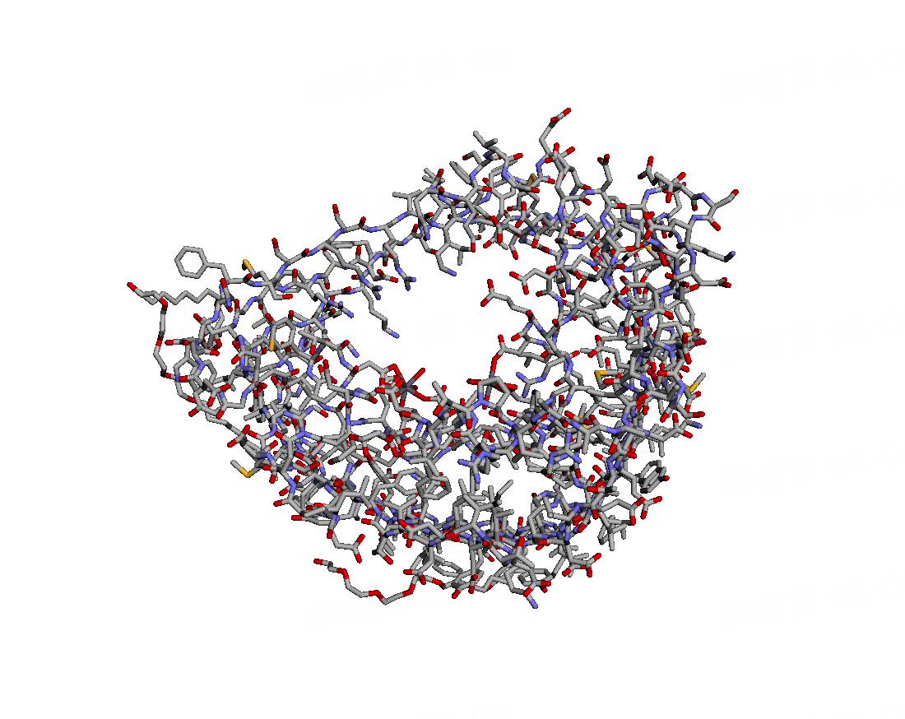

# 当我们说起神经网络等变性，我们在谈论什么

::: tip 作者｜刘思远

本文搬运于：[Notebook 案例广场｜当我们说起神经网络的等变性，我们在谈论什么](https://nb.bohrium.dp.tech/detail/1342)

**你可以直接在上述网站运行或调试文章中的代码**

::: left
<a href="https://nb.bohrium.dp.tech/detail/2412444602" target="_blank"></a>

:::

本文主要讨论在AI for Science领域，使用神经网络建模分子三维构象相关的任务时需要考虑的“等变性”。

作者力求深入浅出，但仍推荐读者对以下背景知识有一定程度的了解后再对本文进行阅读：
1. 神经网络/PyTorch
2. 基础数学（微积分、线性代数中极为基础的部分）
3. AI for Science

::: details 💭 针对不同的阅读意图，作者推荐以下不同的阅读方式：

* 了解等变性的概念和分子体系中常见的等变性：只读第一章《引言》
* 了解神经网络和等变性的关系：读第一章《引言》、第二章《神经网络与等变性》
* 浅显了解等变性在数学里的定义：读第一章《引言》、第二章《神经网络与等变性》、第三章《等变性相关数学》
* 详细了解等变性在神经网络中的实现及各实现方式的优劣：全篇读完

由于篇幅较长，本文尽量言简意赅，减轻阅读压力，提高信息密度。另外，为了不引入解释上的额外负担，可能会有一些术语/概念的混用。

:::

## 🔧 安装依赖

```bash
pip install e3nn py3Dmol matplotlib-venn -i https://pypi.tuna.tsinghua.edu.cn/simple
```

定义一个可视化函数：

```python
import torch
import torch.nn as nn
from e3nn import o3

import py3Dmol

def draw_in_3dmol(mol, fmt):
    viewer = py3Dmol.view(1024, 576)
    viewer.addModel(mol, fmt)
    viewer.setStyle({'stick': {}})
    viewer.zoomTo()

    return viewer
```

## 📚 一、引言

AI for Science领域的许多预测任务，例如分子的势能预测、药物的毒性预测等等，都涉及到用分子的三维构象作为神经网络的输入。\
所谓三维构象，即是分子中各原子的坐标。

思考分子相关的问题时，一种简单有效的心智模型是球棍模型，即将原子看成球，化学键看成连接球的棍。\
实际上，这也是分子在神经网络里常用的输入方法：**将原子视为图的节点，化学键/距离等则定义了图里的边**。

下面的widget是一个蛋白质分子的三维构象的可视化。

```python
mol1 = !curl https://files.rcsb.org/download/2POR.pdb 2>/dev/null
mol1 = '\n'.join(mol1)
view1 = draw_in_3dmol(mol1, 'pdb')

# mol2 = !curl https://pubchem.ncbi.nlm.nih.gov/rest/pug/compound/CID/2244/record/SDF 2>/dev/null
# mol2 = '\n'.join(mol2)
# view2 = draw_in_3dmol(mol2, 'sdf')

view1
```



在分子动力学中，有两个很关键的量，分别是分子的势能，以及分子中的原子相互作用产生在原子核上的受力。\
在本文中，为了解释起来方便，我们也会经常用它们作为例子，所以我们在此详细介绍。\
假设有两个模型可以预测势能和受力，那么它们的形式为：

* 势能模型：$f_E: \{R_i\}_{i=1}^N \rightarrow E$
* 力场模型：$f_F: \{R_i\}_{i=1}^N \rightarrow \{F_i\}_{i=1}^N$

其中$N$为原子数量，$\{R_i\}_{i=1}^N$表示各原子的坐标，$E$为分子的势能，$\{F_i\}_{i=1}^N$为各原子的受力。

那么，$R$、$E$、$F$在计算机里的表示是什么呢？\
显然，$R$是$N$个三维向量，对应着xyz三个坐标轴上的坐标；$E$由于是**整个分子**的势能，因此是一个数字（我们称为**标量**）；$F$和$R$一样都是对应到每个原子，且也有xyz三个方向，因此也是$N$个三维向量。即它们的shape为：
* $R: [N, 3]$
* $E: [1]$
* $F: [N, 3]$

::: warning 🔖接下来，为了说明等变性是什么，请你跟着提示做（如果想象起来很困难，可以只考虑2-3个原子）：

1. 鼠标移到上面的可视化widget。
2. 滑动滚轮使得分子放大/缩小，也就是使它在垂直屏幕的方向做**平移**运动。思考：在这个**平移**的过程中，这个分子的能量和受力会发生变化吗？
3. 按住鼠标左键拖动，使得分子在空间中**旋转**。思考：在这个**旋转**的过程中，分子的能量和受力会发生变化吗？如果有，是怎么变化？提示：受力是原子相互作用的结果。
4. 先把原子从左往右大致编号。接着，重新按从右往左的顺序编号。那么，在这个重新**排列**/**置换**的过程中，分子的能量和受力会发生变化吗？
5. 想象你的屏幕是一个镜子，镜面内倒映出了分子的镜像。那么，在这个**镜面对称**变换导致的镜像分子里，能量和受力会发生变化吗？

**下一个单元格是答案（为防剧透已折叠，请点击展开阅读）。**

:::

::: details 答案在此，点击展开

2. **平移**：势能 - 不变，受力 - 不变
3. **旋转**：势能 - 不变，受力 - 改变，和坐标一起旋转
4. **排列/置换**：势能 - 不变，受力 - 改变，和原子序号一起重新排列
5. **镜面对称**：势能 - *不变*，受力 - *改变，和坐标一起镜面对称（注）*

*注*：镜面对称可能涉及“宇称不对称性”的讨论，但宇称不对称性主要描述弱相互作用，而弱相互作用在分子层面可以忽略不计。
:::

你应该已经看出来了，这里存在两种模式，即“不变”和“一起变”。其中，“一起变”的术语为**“协变”（covariant）**或者**“等变”（equivariant）**。

因此我们会说，势能和受力都具有“平移不变性”，势能有“旋转不变性”，受力有“旋转等变性”。

有时为了方便，也会将标量的“不变”称为“等变”，因此，我们会说分子的势能和受力都有**“旋转平移等变性”（roto-translational equivariance）**，也叫**SE(3)等变性**（名字的由来在下文解释）。

在分子体系的这四种不变/等变性中：

* 置换不变/等变性在神经网络里的实现是自然的，只需要模型不依赖输入的顺序即可（技术上讲即不在$N$这个维度使用CNN、RNN等依赖顺序的结构）
* 镜面对称则主要体现在分子的手性上，而手性分子其实一般都不是严格的镜面对称，而是不能重合的，因此是否实现这种不变/等变性的影响不大，一般不强调这种不变/等变性
* 平移不变性的实现也是简单的，只要模型不依赖分子的绝对坐标，而是依赖原子间的相对坐标即可（例如只用距离）

因此，在本文剩下的内容中，我们主要关注**旋转等变性**。

## 💻 二、神经网络与等变性

在进一步用更正式的概念/数学来定义旋转等变性之前，让我们插播一下神经网络与等变性的关系。

为了更好的阐述，我们需要用一个更数学的视角来看待神经网络：\
**神经网络的架构定义了一个函数族（function family），而训练神经网络就是在这个函数族中搜索正确的那个函数。**

接下来，我们考虑如果神经网络不建模等变性，会发生什么。

1. 我们将所有定义在原子坐标上的函数看成全集
2. 那么**给定一个网络结构**（注），神经网络能表示的函数族是全集的一个子集，符合等变性的函数是另一个子集
3. 神经网络不能表示所有的等变函数，因此两个子集是有交集但不相等的集合。

*注*：如果不给定网络结构，神经网络是通用近似器（universal approximator），其函数族将会等于全集。但在实际中，神经网络是给定结构、不是无限深和无限宽的，因此其表示的函数族是全集的一个子集。

```python
import matplotlib.pyplot as plt
from matplotlib_venn import venn2

# Define the subsets
equivariant_functions = 300
mlp_functions = 300
equivariant_and_mlp = 50

# Define the set labels
labels = ('Plain NN Function Family', 'Equivariant Functions')

# Create the Venn diagram
venn = venn2(subsets=(mlp_functions - equivariant_and_mlp, equivariant_functions - equivariant_and_mlp, equivariant_and_mlp), set_labels=labels, subset_label_formatter=lambda n: "")

# Customize the plot (optional)
plt.title("Relationships among Functions in Euclidean Space")

# Show the plot
plt.show()
```

这会导致什么后果呢？

* 我们希望训练得到的模型落在黄色区域（即交集区域），但**神经网络表示的函数族远大于交集区域，使得我们需要**足够多、足够丰富的数据**才能让神经网络朝着黄色区域训练**
* 而数据量的增大，则**又对神经网络本身的表达力（又称模型容量）提出了更高的要求**
* 回想我们认识等变性的过程（想象），我们会发现等变性是类似常识的存在，因此**不等变的神经网络会显得很不可信**

因此，在AI for Science领域，等变性日益受到重视，逐渐成为对模型的一个基本要求了。当然，正如第四章会说明的那样，取决于具体任务和数据，等变性的实现有各种各样的方式，有时可以很容易地实现。

## 🧮 三、等变性相关数学

在这一节，我们会简单了解**旋转平移等变性**相关的数学。

前面也提到，旋转平移等变性也可以称为**SE(3)等变性**，那么，这个名字，以及类似的O(3)、SO(3)、E(3)，都是什么意思呢？

在数学里，一般用**群论**这门学科来建模对称性。等变性其实就是欧氏空间里的对称性，因此往往也用群论进行建模。O(3)、SO(3)、E(3)、SE(3)都是群的名字。

其实说透了就十分简单：

1. 我们从旋转矩阵出发。如果你了解空间几何，你一定知道**旋转矩阵就是行列式为1的3维正交矩阵**。
2. `O(n)`指的是n维正交矩阵组成的群（O=orthogonal），因此`O(3)`表示所有3维正交矩阵。`O(3)`中的正交矩阵的行列式有+1和-1这两种取值，其中+1的那些就是所有旋转矩阵，-1的那些则是*瑕旋转*矩阵（表示旋转+一次镜面对称）。
4. `SO(3)`是`O(3)`的子群（SO=special orthogonal），表示`O(3)`中的所有行列式为+1的元素。因此，`SO(3)`就是全体旋转矩阵。
5. `E(3)`中的元素等于`O(3)`里的元素加上任意平移变换（E=Euclidean），因此`E(3)`表示任意旋转、镜面对称、平移操作的复合。
6. `SE(3)`类似`E(3)`，是任意旋转、平移操作的复合。

总而言之，这些名字代表了欧氏空间里变换操作的集合。因此一个东西具有**SE(3)等变性**的意思就是它**在SE(3)的元素所代表的变换下，是等变的**，即旋转平移等变性。

⚠️ 警告：从这里开始的蓝框中会有一点点硬核数学，看不懂也没关系（可能是篇幅所限没讲清楚），不影响后续阅读和整体理解。

下面给出不变/等变性用群论的数学语言的定义：

::: tip 📖不变性和等变性

$G$是一个群，它在向量空间$V$和$W$上均定义有群作用（group action）$*: G \times V \rightarrow V$和$*: G \times W \rightarrow W$。\
对于函数$F: V \rightarrow W$，

* 如果有$\forall \mathbf{v} \in V, g \in G, F(g*\mathbf{v})=F(\mathbf{v})$，则称$F$为$G$-不变的。
* 如果有$\forall \mathbf{v} \in V, g \in G, F(g*\mathbf{v})=g*F(\mathbf{v})$，则称$F$为$G$-等变的。

（等式左右边的$*$分别是$V$和$W$上的$*$）

:::

如果我们联系一下上下文，这里的：

* $F$是神经网络
* $V$是原子坐标所在的欧氏空间$\mathbb{R}^3$
* $W$取决于任务，可以是$\mathbb{R}$（标量），$\mathbb{R}^3$（向量）等
* $G$就是$SE(3)$
* $*$对于向量（如力）是旋转矩阵，对于标量（如势能）则是1。

::: details 可选阅读：球谐函数 

<b>📖球谐函数</b>

构造等变神经网络的一种方式是，在神经网络的层中采用等变的中间表示，并全程保持上述群等变性。\
这里的中间表示的一个很自然的选择是球谐函数（spherical harmonics）的系数。\
在此基础上，群作用$*$为所谓的Wigner-D矩阵。\
另外，神经网络还必须保证对中间表示不做（张量意义上的）非线性操作，否则会破坏整体的等变性。\
此处不做过多展开，感兴趣的读者可以阅读[Tensor Field Networks](https://arxiv.org/abs/1802.08219)及其相关工作。

:::

## 💿 四、等变性的实现要求

由上述定义，不难发现，保持等变性的一个重要方式是**保证操作是线性的**。\
这里的线性指的是对整个向量（或者L阶张量，如果你明白这是什么意思）共用一个乘数和加数，即$a\mathbf{x} + b$，其中$a$和$b$均为**标量**。

还有一种常见的方式，是**标量化**，即将向量转化为标量进行运算，例如（$R$为任意旋转矩阵，$\mathbf{a}$、$\mathbf{b}$为两个向量）：
* 内积。$(R \mathbf{a}) \cdot (R \mathbf{b})=(R \mathbf{a})^T (R \mathbf{b})=\mathbf{a}^T (R^T R) \mathbf{b}=\mathbf{a}^T \mathbf{b}=\mathbf{a} \cdot \mathbf{b}$。利用了正交矩阵的性质。
* 范数，例如距离。$||R \mathbf{a} - R \mathbf{b}||_2 = ||R(\mathbf{a} - \mathbf{b})||_2 = ||\mathbf{a} - \mathbf{b}||$。这也是利用了正交矩阵的性质。

下面将通过一系列例子来辅助理解。

::: warning 🔖代码例子1. 坐标MLP（多层感知机） 预测受力

为了更好的理解，下面给出一个极为简单的、没有考虑等变性的、用于预测受力的神经网络的例子。\
具体来说，这个网络会在坐标维度做一个带有$ReLU$非线性的MLP。

思考：这里违反了什么原则，使得网络不等变？如果去掉`nn.ReLU`这个层，会使网络变得等变吗？动手试一试，符合你的预期吗？

:::

:::: code-group
::: code-group-item Python
```python
# 定义网络结构
mlp = nn.Sequential(nn.Linear(3, 128), nn.ReLU(), nn.Linear(128, 3))

# 随机初始化一个分子里的原子坐标，这里假设只有3个原子；并随机初始化一个旋转矩阵，用它来对坐标进行旋转
coords = torch.randn(3, 3)
rot = o3.rand_matrix()

# 如果网络不变，那么以下式子应当成立：mlp(coords) == mlp(coords @ rot)
# 如果网络等变，那么以下式子应当成立：mlp(coords) @ rot == mlp(coords @ rot)
print('mlp(coords)\n', mlp(coords), sep='')
print('mlp(coords) @ rot\n', mlp(coords) @ rot, sep='')
print('mlp(coords @ rot)\n', mlp(coords @ rot), sep='')
```
:::
::: code-group-item Output
```text:no-line-numbers
mlp(coords)
tensor([[-0.8052,  0.3826, -0.2735],
        [-0.4406,  0.3193, -0.1418],
        [-0.1014,  0.0261,  0.3053]], grad_fn=<AddmmBackward0>)
mlp(coords) @ rot
tensor([[-0.4279,  0.8063,  0.1906],
        [-0.2829,  0.4414,  0.2032],
        [-0.2861, -0.1211, -0.0876]], grad_fn=<MmBackward0>)
mlp(coords @ rot)
tensor([[-0.2188,  0.0615,  0.2156],
        [-0.1585,  0.0278,  0.7045],
        [-0.2306,  0.0618,  0.0029]], grad_fn=<AddmmBackward0>)
```
:::
::::


::: warning 🔖 代码例子2. 距离MLP 预测受力

这次，我们将采用标量化技术。即，我们将用距离作为神经网络的输入，预测各原子的受力。

思考：这个网络是不变的还是等变的？我们预测的是力，这符合要求吗？
:::

```python
# 定义网络结构与预测函数
mlp = nn.Sequential(nn.Linear(1, 128), nn.ReLU(), nn.Linear(128, 3))

def predict(coords):
    dist = (coords.view(-1, 1, 3) - coords.view(1, -1, 3)).norm(dim=-1).unsqueeze(-1)  # 计算距离矩阵
    forces = mlp(dist).mean(dim=-2)  # 前向，取各边的均值作为预测值
    return forces


# 随机初始化一个分子里的原子坐标，这里假设只有3个原子；并随机初始化一个旋转矩阵，用它来对坐标进行旋转
coords = torch.randn(3, 3)
rot = o3.rand_matrix()

# 如果网络不变，那么以下式子应当成立：predict(coords) == predict(coords @ rot)
# 如果网络等变，那么以下式子应当成立：predict(coords) @ rot == predict(coords @ rot)
print('predict(coords)\n', predict(coords), sep='')
print('predict(coords) @ rot\n', predict(coords) @ rot, sep='')
print('predict(coords @ rot)\n', predict(coords @ rot), sep='')
```

::: details 答案

这两段代码都没有实现正确的等变性，具体来讲：

1. **代码例子1**。显然受力的预测值未满足等变性。你可能很快会发现原因可能是`ReLU`这个非线性的引入，但去掉之后受力依然不满足等变性。这是因为，等变性要求里的**线性**是很严格的，它需要在整个向量层面的线性（即第一层的权重W不能是`(3,128)`，只能是`(1,128)`，并对网络剩余部分做相应修改，使整个网络变成在向量层面上操作）。
2. **代码例子2**。这是我们需要严格区分不变性和等变性的地方。可以发现，这个网络的力对于坐标输入是SE(3)不变的，但这并不符合物理的要求。
:::

你答对了吗？

想看到一个正确的实现等变性的代码例子？那就接着往下阅读吧～

## 🎬 五、等变性在神经网络中的实现方式

在这一节，我们会介绍等变性在神经网络的主要实现方式：

* 数据增强
* 0阶不变 -> 1阶等变
* 向量网络
* 张量场网络
* 局部坐标系
* 其他方法

篇幅所限，我们只能非常简单地、走马观花地看一遍。推荐感兴趣的读者查阅相关论文做进一步了解。

::: tip 💭比较各实现方式时需要考虑的因素

在开始介绍之前，由于我们需要对比各实现方式的优劣，这里简单介绍一下作者在比较的时候会用哪些因素做思考：

* 想学的等变量是几阶张量，具体的物理意义（对坐标的积分是什么含义，是否不变量）\
  比如，力为1阶张量，能量为0阶张量（标量），原子基组下的哈密顿量（Hamiltonian）为多个高阶张量组成的矩阵。另外，势能和力有求导的关系（详见下文）。
* 数据集的样本量 \
  样本量大，则需要更长的训练时间；样本量小，则需要强的模型先验。
* 数据集的样本来源（实验vs计算） \
  实验数据可能会有噪声，导致也许未必完全符合等变性；计算数据往往完全符合等变性。
* 网络设计是否会受到约束 \
  为了实现等变性，是否对网络设计带来比较大的约束（比如上述不能含有非线性的要求）。
* 这种实现方式的完备性 \
  这种实现方式是否可以覆盖足够大的等变函数族。

:::

### 方式一：数据增强

* **实现方式** \
  网络设计不追求等变性，但也不违反等变性（例如代码例子2就违反了，等变的力预测成了不变的），通过数据增强来强行让模型学到等变性。\
  此处的数据增强主要指随机旋转输入构象，并相应地旋转标签。\
  一般，训练完的网络不具有严格的等变性，但误差在可以接受的范围内。
* **特点** \
  模型的设计几乎不受约束，参数量可以很大，表达能力强。
* **适用场景** \
  样本量大、数据分布广、旋转操作成本不大（如力等向量）、等变性并非很重要的问题时（如预训练）
* **不适用场景** \
  标签的旋转成本很大（如哈密顿量）、等变性是第一需要考虑的（如力场）
* **例子** \
  [Unimol+](https://arxiv.org/abs/2303.16982)、[SchNOrb](https://www.nature.com/articles/s41467-019-12875-2)等

  ### 方式二：0阶不变 -> 1阶等变

  * **实现方式** \
  这种方式实际上几乎专指标量化的力场模型。\
  由于势能和力有一个特殊的关系$F_i=-\nabla_{R_i} E(\{R_i\}_{i=1}^N)$，这使得我们可以训练一个标量化（如只用距离或坐标点乘做输入的）网络输出0阶不变的势能，再求此输出对输入坐标的导数时，可以得到1阶等变的力。\
  这种方式实际上很难迁移到其他任务上。
* **特点** \
  模型的设计几乎不受约束，参数量可以很大，表达能力强，免费的严格等变性。
* **适用场景** \
  几乎只能用在势能面/力场任务里。
* **不适用场景** \
  除势能面/力场以外的任务。
* **例子** \
  [DPA-1](https://arxiv.org/abs/2208.08236)、[SchNet](https://arxiv.org/abs/1706.08566)、[GemNet](https://arxiv.org/abs/2106.08903)、[DimeNet](https://arxiv.org/abs/2003.03123)等

下面给出一个代码例子辅助理解。

::: tip 🔖代码例子3. 距离MLP 预测势能 反传得力

势能和力有一个特殊的关系$F_i=-\nabla_{R_i} E(\{R_i\}_{i=1}^N)$，这使得0阶不变的势能模型可以通过求梯度的方式得到1阶等变的力

:::

```python
# 定义网络结构与预测函数
mlp = nn.Sequential(nn.Linear(1, 128), nn.ReLU(), nn.Linear(128, 1))

def predict(coords):
    dist = (coords.view(-1, 1, 3) - coords.view(1, -1, 3)).norm(dim=-1).unsqueeze(-1)  # 计算距离矩阵
    output = mlp(dist).squeeze(-1)  # 前向
    atom_contribution = output.mean(dim=-1)  # 取各边的均值作为原子能量
    energy = atom_contribution.sum(dim=-1)  # 取各原子的贡献之和为总能量
    return energy

def predict_forces(coords):
    coords = coords.clone().requires_grad_()  # 使坐标接受梯度
    predict(coords).backward()  # 求能量对坐标的梯度
    forces = -coords.grad  # 力为坐标上的梯度的相反数
    return forces


# 随机初始化一个分子里的原子坐标，这里假设只有3个原子；并随机初始化一个旋转矩阵，用它来对坐标进行旋转
coords = torch.randn(3, 3)
rot = o3.rand_matrix()

# 预测的势能是不变的，以下式子应当成立：predict(coords) == predict(coords @ rot)
print('predict(coords)\n', predict(coords), sep='')
print('predict(coords @ rot)\n', predict(coords @ rot), sep='')

# 预测的力是等变的，以下式子应当成立：predict_forces(coords) @ rot == predict_forces(coords @ rot)
print('predict_forces(coords) @ rot\n', predict_forces(coords) @ rot, sep='')
print('predict_forces(coords @ rot)\n', predict_forces(coords @ rot), sep='')
```

### 方式三：向量网络

* **实现方式** \
  既然等变量不可以有非线性，而不变量可以有非线性，那就将模型分成两个分支，一支处理等变量，一支处理不变量。\
  其中，不变量一般为距离或坐标点乘等，等变量一般为相对坐标$R_{ij}=R_i - R_j$，因此可以称为向量网络。
* **特点** \
  模型的设计会受到一些约束（但相应地也可以产生许多花样），主要需要考虑等变分支和不变分支的网络设计，以及两个分支之间的交互。参数量可以很大，表达力强，是比较折中的可以实现严格等变性的方案。\
  但作者认为（未证实观点），也许有的向量本质上不是相对坐标的线性组合，而是由高阶张量的张量积产生的，可能因此有的任务看起来能用，但实际上模型不能学到最“物理”的那个函数。
* **适用场景** \
  只能预测标量和向量，不能预测高阶张量。虽说如此，但也几乎可以适用于所有场景了。
* **不适用场景** \
  几乎没有。
* **例子** \
  [Unimol](https://openreview.net/forum?id=6K2RM6wVqKu)、[EGNN](https://arxiv.org/pdf/2102.09844)、[Equivariant Transformer](https://openreview.net/forum?id=zNHzqZ9wrRB)、[ClofNet](https://proceedings.mlr.press/v162/du22e/du22e.pdf)等

  ### 方式四：张量场网络

  * **实现方式** \
  这是最激进的一种方式，网络直接采用球谐函数的系数作为中间表示，并严格控制网络中所有操作均遵守等变性（例如没有非线性、归一化层也需要特殊处理等等）。\
  一般采用张量积作为主要算子。
* **特点** \
  为了等变性改变整个模型的所有设计，模型的设计会受到极大约束，张量积占用显存很大，且训练中容易产生数值稳定性问题。\
  但由于采用了球谐函数作为中间表示，模型可以输出任意阶等变的张量了，在一些场景（如哈密顿量）是很重要的。\
  且模型的先验很强，参数量小，可以在极小的数据量下训练出精度较高的模型。\
  另外，在完备性上可能优于向量网络。
* **适用场景** \
  几乎所有场景都可以用。
* **不适用场景** \
  显存告急时不适合。另外，也许数据量很大（会慢）或包含噪声（和强先验不匹配）时也不太适合。
* **例子** \
  [Tensor Field Network](https://arxiv.org/abs/1802.08219)、[MACE](https://arxiv.org/abs/2206.07697)、[Equiformer](https://arxiv.org/abs/2206.11990)等

  ### 方式五：局部坐标系

  * **实现方式** \
  通过给每个原子（或每个原子对）定义一个局部坐标系，我们可以提前将等变量旋转到这个局部坐标系上。\
  这样，在绝大多数时候，这个等变量就变成不变量了。因此可以用任意网络做预测。\
  得到模型的预测值后，再将预测值相应地旋转回原本的全局坐标系上。
* **特点** \
  模型设计不受任何约束。但由于具体坐标系的确定往往涉及到按原子距离的远近选择坐标轴的方向，当“当前原子”和“最近原子”以及“次近原子”的距离比较相近时，坐标的细微差别可能会导致坐标轴方向的剧烈变化。\
  这导致模型可能需要捕获这种突变性。这个“突变”问题是局部坐标系的最重要的缺陷。
* **适用场景** \
  几乎适用任意场景。
* **不适用场景** \
  训练出来如果精度未达预期，可能会怀疑是“突变”导致的。这时候可能会认为这种方法不适用。
* **例子** \
  [DeepH](https://www.nature.com/articles/s43588-022-00265-6)、[DeepPot](https://proceedings.neurips.cc/paper_files/paper/2018/file/e2ad76f2326fbc6b56a45a56c59fafdb-Paper.pdf)等

### 其他方式

上面仅罗列了比较流行的五种实现方式。除了这些方式，还有一些其他方式可以实现等变性，例如LieTransformer等，就留待读者自行探索了！

## 🔚 结语

:::tip 🎖️恭喜你！你已经读完这篇notebook。
:::

等变网络目前是人工智能顶会上的热门课题，领域发展日新月异。\
例如，前段时间似乎又出现了Cartesian Tensor Network等新的实现等变性的方法。\
如果读完本文后，你对相关课题感受到一丝兴趣，欢迎[一起讨论](mailto:liusy@dp.tech)！