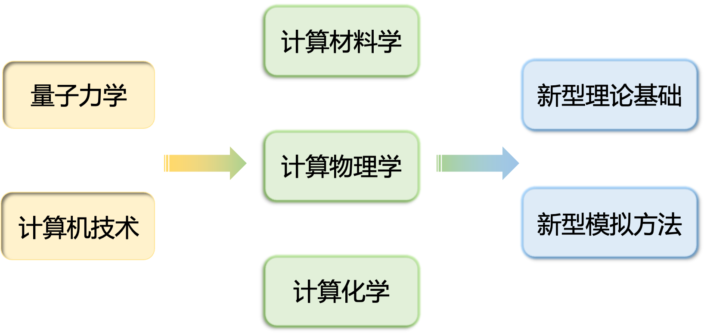
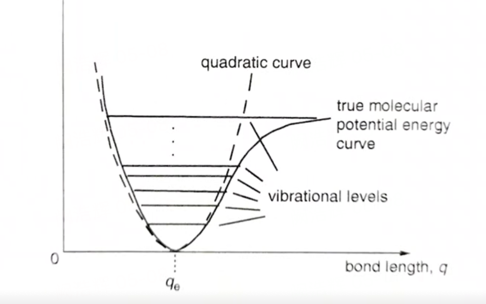
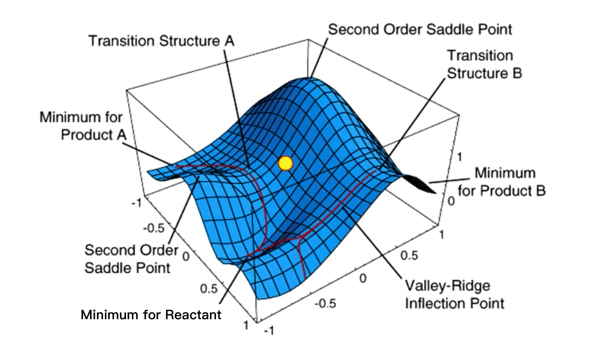
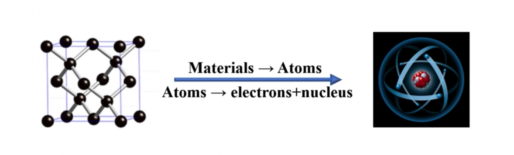
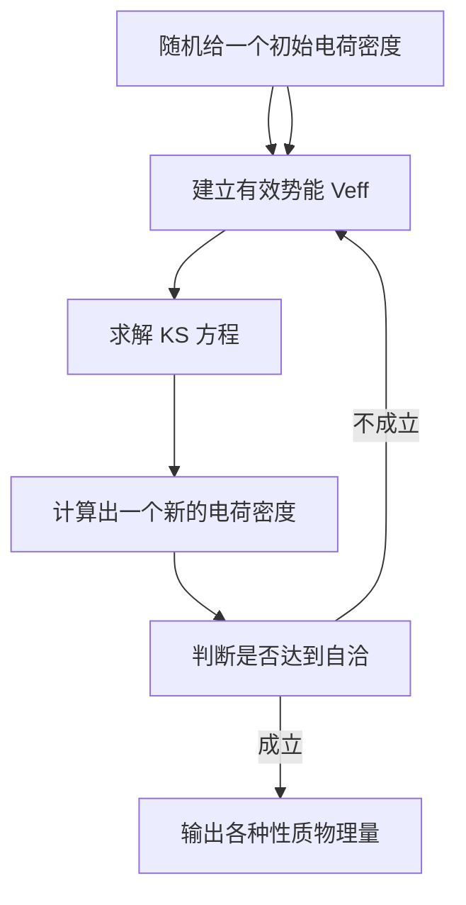

# 快速了解第一性原理计算

::: tip 第一性原理计算:

第一性原理计算是指基于<b>量子力学原理</b>的计算方法，通过求解薛定谔方程来预测材料的性质和行为。

:::

## 量子力学的提出

1687 ，牛顿在《自然哲学的数学原理》【1】一书中总结出了牛顿经典力学，向我们描述了宏观物体的运动规律。

19 世纪末，人们发现一些科学现象，例如黑体辐射【2】、光电效应【3】、原子光谱【4】等，无法被牛顿经典力学所解释。

**人类科学的研究从那个时候开始从宏观世界转向更微观的世界。**

1900 年，普朗克在《在黑体光谱中的能量分布》论文中，普朗克假定能量在发射和吸收的时候，不是连续不断的，而是一份一份的，**量子**就是能量的最小单位。【2】

1905 年，爱因斯坦从普朗克的量子假设出发，提出了“光量子”（也即现在的“光子”），成功解释了光电效应。【3】

1913 年，玻尔从量子论假设得到启发提出了玻尔原子模型，解释了原子光谱。【4】

随后，海森堡和薛定谔分别推导出电子的运动方程。【5，6】

> 1. Newton, I. (1687). Philosophiæ Naturalis Principia Mathematica. T. R. Robinson.
> 2. Planck, M. (1900). Zur Theorie des Gesetzes der Energieverteilung im Normalspektrum. Verhandlungen der Deutschen physikalischen Gesellschaft, 2, 237-245.
> 3. Einstein, A. (1905). Über einen die Erzeugung und Verwandlung des Lichtes betreffenden heuristischen Gesichtspunkt. Annalen der Physik, 322(6), 132-148.
> 4. Bohr, N. (1913). On the Constitution of Atoms and Molecules. Philosophical Magazine, 26(151), 1-25.
> 5. Heisenberg, W. (1925). Über quantentheoretische Umdeutung kinematischer und mechanischer Beziehungen. Zeitschrift für Physik, 33(1), 879-893.
> 6. Schrödinger, E. (1926). An Undulatory Theory of the Mechanics of Atoms and Molecules. Physical Review, 28(6), 1049-1070.

---

* 海森堡直接从观测到的原子谱线出发，引入矩阵的数学工具，建立了矩阵力学，它强调了**粒子性**。

* 薛定谔的波动力学强调电子作为波的连续性的一面，以波动方程来描述电子的行为。强调了**波动性**。

后来发现，矩阵力学和波动方程在数学上竟然是等价的，这就是“波粒二象性”。波尔的“互补原理”，连同波恩的概率解释，海森堡的不确定性，三者共同构成了量子力学的核心。

## 状态与波函数

* **经典力学中的质点：**经典力学中的质点指的是宏观客体的抽象，即具有质量，但体积和形状忽略不计。质点在任意给定的条件下总是沿着一定的轨道运动。**在每一个瞬间，它的各种力学量，如坐标、动量、角动量、能量等的取值都是完全确定的。**质点一切力学量的集合就是该质点在该时刻的力学状态，可以用下式表述：
  $$
  L=L(\vec{r},\vec{p},t)
  $$
  其中 $\vec{r}$ 表示坐标，$\vec{p}$ 表示动量，$t$ 表示时间。

* **量子力学中的粒子：**粒子的状态为某一瞬间的取值概率分布的集合。不明白？没有关系，我们来看一个例子：

  

*Source: Science Advances, 10.1126/sciadv.aaw0392*

1927年，Davission 和Germer 将电子射线以一定的速度射出，穿过晶体粉末射到接收屏上。

电子的运动表现出一定的统计规律：单个电子的一次行为是不确定的，它可能到达接受屏上的任意一个地方：但单个电子的多次重复行为是完全确定的，即在接受屏上形成一定的衍射花祥。

### 【选读】三大基本假设：

#### 假设一：

**描述微观粒子的任意状态，总可以用相应的一个波函数 $\Psi{(\vec{r}, t)}$ 来描述，与在时刻 $t$ 在空间 $\vec{r}$ 处发现一个粒子的概率成正比。**→ 波函数是量子力学中用来描述微观粒子状态的。**

> 波函数只对在同一宏观条件下，大量的、同种的且相互无关的粒子的集合或单个粒子的多次重复行为才有直接的意义，面对个别粒子的一次行为，一般来说只有间接的也就是概率性的意义。

#### 假设二

微观粒子的任意一个给定的力学量L，总可以用相应的一个算符L来表示，其中算符L的本征值谱就是实验上观测到的力学量L的全部可能取值。

> 经典力学中采用坐标和动量描述质点的力学状态，量子力学中采用波函数描述微观粒子的力学状态，在量子力学中，需要将力学量改造成与经典力学不同的算符形式，例如动量算符、角动量算符、哈密顿算符、拉格朗日算符等。

在经典力学中，如声和光等波动理论中都有波的叠加原理：两个可能的波动过程 $\Psi_1$和$\Psi_2$线性叠加的结果是$a\Psi_1+b\Psi_2$，也是一个可能的波动方程。

#### 假设三

如果 $\Psi_1{(\vec{r}, t)}$ 和 $\Psi_2{(\vec{r}, t)}$ 分别表示微观体系的两个可能的状态，则由这两个波函数线性组合所得到的波函数  $\Psi{(\vec{r}, t)}=c_1 \times \Psi_1{(\vec{r}, t)}+c_2 \times \Psi_2{(\vec{r}, t)}$ 所描写的也是这个体系可能的状态。

> 量子化学中的许多基本概念和理论都是基于状态叠加原理，如杂化轨道的概念。将同一原子中的$s、p、d、f$轨道进行适当的线性组合，即得杂化轨道，它也是电子的一种可能的量子态，且线性组合的系数绝对值的平方即代表参与杂化的某原子轨道出现的概率。

## 薛定谔方程

上一节已说明，**微观粒子的力学状态可以用波函数来描述。**

那么，怎样**反映微观粒子的状态随时间的变化规律？**需要建立微观粒子的运动方程，1926 年，薛定谔提出该方程，标志着量子力学的完全建立。也即薛定谔方程。

---

定态薛定谔方程的简化形式如下，即能量算符的本征方程：
$$
\hat{H}\psi(\vec{r})=E\psi(\vec{r})
$$
其中，$\hat{H}$ 是哈密顿算符，表达式如下：
$$
\hat{H}=-\sum_i^{\text {electrons }} \frac{h^2}{2 m_e} \nabla_i^2-\sum_A^{\text {nulei}} \frac{h^2}{2 m_A} \nabla_A^2-\sum_t^{\text {electrons}} \sum_A^{\text {nulei}} \frac{e^2 Z_A}{r_{iA}}+\sum_{i>j}^{\text {electrons }} \frac{e^2}{r_{i j}}+\sum_{A>B}^{\text {nulei }} \frac{e^2 Z_A Z_B}{r_{A B}}
$$
$r$ 代表距离，$i$ 是电子，$A$ 是原子核，$m_e$ 和 $m_A$ 分别是电子和原子核的质量，$h$ 为普朗克常数，$\nabla^2$ 为拉普拉斯 Laplace 算符。
$$
\nabla^2=\frac{\partial^2}{\partial x^2}+\frac{\partial^2}{\partial y^2}+\frac{\partial^2}{\partial z^2}
$$
不要被这么长的公式吓到，让我们来逐项看一下哈密顿算子：

* 第一项代表**电子**的动能；
* 第二项代表**原子核**的动能；
* 第三项代表**电子-原子核**的引力势能；
* 第四项代表**电子-电子**排斥势能；
* 第五项表示**原子核-原子核**排斥势能；

### 【选读】为什么哈密顿算符中有负号

**再来解释一下哈密顿算符中出现负号的原因。**

哈密顿算符中负号的出现是由于动能项和电子与原子核之间的库仑势能项的定义导致的。

首先，考虑动能项：

$$
\hat{T}_i=-\frac{h^2}{2 m_e} \nabla_i^2
$$

这里的负号来自于薛定谔方程中的负号。薛定谔方程是：

$$
\hat{H}\psi = E\psi
$$

其中 $\hat{H}$ 是哈密顿算符，$\psi$ 是波函数，$E$ 是能量。在量子力学中，我们通常使用拉普拉斯算子 $\nabla^2$ 描述动能项。拉普拉斯算子的定义是：

$$
\nabla^2 = \frac{\partial^2}{\partial x^2} + \frac{\partial^2}{\partial y^2} + \frac{\partial^2}{\partial z^2}
$$

拉普拉斯算子作用在波函数上会导致波函数的曲率（二阶导数）的变化。波函数曲率的变化与系统的动能有关。正的曲率与负的动能相关，负的曲率与正的动能相关。因此，在动能项中，我们需要一个负号来确保曲率与动能之间的正确关系。

接下来，考虑电子与原子核之间的库仑势能项：

$$
-\sum_t^{\text {electrons}} \sum_A^{\text {nulei}} \frac{e^2 Z_A}{r_{iA}}
$$

这里的负号来自于电子和原子核之间的相互作用。由于电子带负电荷，原子核带正电荷，电子与原子核之间的相互作用是吸引的，所以其势能是负的。库仑势能公式为：

$$
V(r) = \frac{k_e q_1 q_2}{r}
$$

其中 $k_e$ 是库仑常数，$q_1$ 和 $q_2$ 是带电粒子的电荷，$r$ 是它们之间的距离。在电子与原子核之间的相互作用中，$q_1$ 是电子的电荷（负），$q_2$ 是原子核的电荷（正），$r$ 是它们之间的距离。为了保持正确的符号，我们需要在这个势能项前面加一个负号。

综上所述，哈密顿算符中前三项前面的负号分别表示动能项和电子与原子核之间的库仑势能项的定义。

---

对于原子和分子体系来说，电子之间、原子核之间以及电子-原子核之间的相互作用主要是电磁相互作用，所以有关的薛定谔方程很容易写出来。

但事实上，只有当单电子体系时，薛定谔方程可以被精确的求解，比如氢原子。而对于多粒子体系薛定谔方程的精确解，目前实际上是不可能的。

狄拉克（狄拉克也是量子力学奠基人之一，与薛定谔共同分享了 1933 年的诺贝尔物理奖）曾在论文中说：

::: danger 📕 基本物理定律是完全已知的，但是方程太复杂，无法求解。
:::

**因此，我们可能需要一些“近似”的处理方法，让我们先来看看经典的 Born-Oppenheimer 近似，又称为大名鼎鼎的「绝热近似」。**

> Born-Oppenheimer 近似：
>
> 背景：对于多粒子体系，体系的运动狀态需要同时考虑电子和原子核的运动，考虑更精细一些，还要包括：
>
> * 电子的旋-轨耦合作用
> * 电子自旋-核自旋相互作用
> * 核自旋-核自旋相互作用
>
> 同时考虑这些运动太复杂了。因此引入了最重要的简化，Born-Oppenheimer 近似。
>
> 方法：由于原子核的质量比电子大得多，运动比电子慢得多，因此在一般情况下，可以把原子核看做不动而把原子核和电子的相对运动看做是电子围绕不动的原子核运动的问题。

但即使是这样，通过求解薛定谔方程来描述多粒子体系也是不可行的，举个例子：

> 考虑实空间有10×10x10个离散点，对于 He 原子，只有两个电子，它的波函数将由约 $5×10^5$ 的一组成员来定义；
>
> 而 C 原子，有 6 个电子，问题的维度大约是$10^{15}$ 。
>
> 如果考虑的离散点更多，则更为复杂。对于较大一点的休系，解薛定谔方程的难度已经是一个天文数字。

所以量子方法的一个重要内容就是研究多电子薛定谔方程的近似解法。

::: warning 因此，我们在具体应用第一性原理方法中需要选择更进一步的近似方法，例如：半经验方法、HF 方法、电子相关方法、密度泛函方法 (DFT) 等。
:::

## 方法和基组

> 不同的理论方法对应于薛定谔方程的不同近似，每种方法都有各自的精度、计算成本和资源要求。

### 常见方法特点及其应用

#### 半经验方法（如 PM6、AM1）

半经验方法是**计算成本相对较低**的方法，计算速度快、计算所需要的磁盘空间和计算机内存小。

在计算大体系时比较有用。

但是的缺点在于，由于引入了可调参数，借用经验或半经验参数代替分子积分，因此在计算某些性质时，产生的误差随意性大，**结果可靠性不高。**

#### HF 方法

**Hartree-Fock 是计算成本最低的从头算方法。**

它可以描述为通过将问题简化为一组单电子问题来求解多电子体系的薛定谔方程的一种尝试。每一个电子都存在于原子核的场中，而其他电子的影响只用一个平均场来代替，忽略了具体的电子相关性对其运动的影响。

这是一个严重的近似，事实上电子并不能独立的运动，电子之间的相互制约作用称为电子运动的瞬时相关性或电子的动态相关效应。

而 HF 方法没有考虑电子相关作用，导致一定误差。

#### 电子相关方法

包括组态相互作用 CI、微扰理论 MP、耦合簇方法 CC 等。

比如常见的 MP2、CCSD 等。这些方法都是在 HF 方法基础上进行的改进，加入了由于电子间库伦排序导致的瞬时效应和动态效应，即库伦相关校正。这些方法的特点是计算成本高，但计算结果精确度也高。

#### 密度泛函理论

密度泛函理论目前是凝聚态物理计算材料学和计算化学领域**最常用的方法之一**。

**HF 方法和电子相关方法都是基于复杂的多电子波函数的。**

假设有 N 个电子数，每个电子包含 3 个空间变量和一个自旋坐标，则多电子波函数就有 4N 个变量。

如果考虑反对称性，正确的多电子波函数需要用 Slater 行列式来描述，如果研究激发态，还要多个 Slater 行列式，并考虑其组态相互作用，这样具体计算时困难非常大。

### 基组 (Basis set)

**基组，是构建量子力学波函数的数学函数集合。**

指定一个基组可以解释为限制每个电子到特定的空间区域。

大的基组意味着对电子较少的约束，因此计算量较大，但计算结果较精确。

#### 最小基组 STO-3G

* **最小基组 STO-3G**，每一个基本函数中含有三个高斯函数，于是就有了 3G 的名称。STO 代表 Slater 型的轨道，这样，STO-3G 就表示采用三个高斯函数来描述 Slater 轨道。

#### 双分裂价基组

* **双分裂价基组**则对于价键轨道都用两个函数来进行描述，比如 3-21G 表示非价轨道用一个基函数描述，这个基函数由 3 个高斯函数拟合而成；价轨道用两个基函数描述，这两个基函数中一个由2个高斯函数拟合，另一个由1个高斯函数拟合。

  > 小练习：
  >
  > C 原子若使用基组 6-31G，它的基函数有多少个？
  >
  > 答案：$1 + 4*2 = 9$

#### 极化基组

* **极化基组**：分裂基组允许轨道改变其大小，但不能改变形狀。极化基组则取消了这样的限制，增加了一个描述高阶角动量的基函数。

  * 比如 $6-31G(d)$ 和 $6-31G(d,p)$。$6-31G(d)$ 基组来源于 $6-31G$ 基组，并在其基础上，对于非氢原子增加了一个 $d$ 轨道，在笛卡尔坐标系中，有 $d_{x^2}$， $d_{y^2}$， $d_{z^2}$， $d_{xy}$， $d_{xz}$， $d_{yz}$。
  * $6-31G(d,p)$ 又在 $6-31G(d)$ 的基础上，在氢原子轨道中加入了一个 $p$ 轨道。

  > C 原子若使用基组 $6-31G(d)$，它的基函数有多少个？
  >
  > 答案是：$1+4\times2+6 = 15$

#### 弥散函数

* **弥散函数**是 $s$ 和 $p$ 轨道函数的“大号”的版本，它们允许轨道占据更大的空间，用 $+$ 表示。

  * 比如 $6-31+G(d)$，$6-31G++(d)$。
  * $6-31+G(d)$ 基组表示的是 $6-31G(d)$ 基组在重原子上加上弥散基组，$6-31++G(d)$ 基组表示对于氢原子也加上弥散函数。

  > C 原子若使用基组 $6-31+G(d)$，它的基函数有多少个？
  >
  > 答案是：$1+4\times2+6+4=19$

#### 高角动量基组

* **高角动量基组**是在分裂价层基组基础上增加多个极化基函数，比如 $6-31G(2d)$ 是在 $6-31G$ 基础上增加两个 $d$ 轨道的函数。$6-311++G(3df,3pd)$ 则增加了更多的极化函数，包括三个分裂的价键基组，在重原子和氢原子上加的弥散函数，在重原子上加的三个 $d$ 函数和一个 $f$ 函数，在氢原子上加的三个 $p$ 函数和一个 $d$ 函数。

---

第三周期以上的原子的基组很难处理。由于存在非常大的核，原子核附近的电子通过有效核电势方法 (ECP) 进行了近似，其中，LanL2DZ 是最常用的赝势基组。

## 势能面 (Potential Energy Surface, PES)

势能面 (potential energy surface，简称 PES) 即分子能量与几何结构之间的关系，换句话说，势能面是 **把分子能量表示为其几何结构的函数。**
$$
E=f(q_1, q_2, ...q_n)
$$
其中 $E$ 为分子的势能，$q$ 是结构参数。

> 势能面在量子化学，分子光谱，分子反应动力学和分子力学模拟中占有十分重要的地位。建造性能优良的势能面是量子化学计算的目标，同时又是动力学计算的起点。

* 在双原子分子中，比如 $O_2$，势函数仅是核间距的函数，即仅有一个结构参数 $R_{eq}=$ 键长，因此势能面表现为一条曲线。

* 在三原子分子中，比如 $H_2O$，假设两个 $O-H$ 键长相等，那么有两个结构参数：$[1]$ $O-H$ 键长，$[2]$ $H-O-H$ 键角。

体系由 $N$ 个原子组成，共有 $3N$ 个核位置坐标。

将平动坐标和转动坐标去掉后，**势函数只包含 $3N-6$ [非线性分子] 或 $3N-5$ [线性分子] 个内坐标 [键长，键角，二面角等]。**

#### 几何优化

由构建的分子结构 [初始结构] 出发，系统的改变核坐标 $\{q_i\}$，通过分子内部运动的势能 $E=f(q_1,q_2,\cdots,q_n)$ 下降的办法，使得核骨架 $\{q_i\}$ 进一步逼近稳定的分子结构。

常见的方法有：梯度下降法，牛顿和拟牛顿法，共轭梯度法等。

## 密度泛函理论 (Density Fuctional Theory, DFT)

宏观物质的性质由微观结构决定。

---

#### 波函数与薛定谔方程

前面薛定谔方程一节中说明了定态薛定谔方程的形式如下，即能量算符的本征方程：
$$
\hat{H}\psi(\vec{r})=E\psi(\vec{r})
$$
其中，$\hat{H}$ 是哈密顿算符，表达式如下：
$$
\hat{H}=-\sum_i^{\text {electrons }} \frac{h^2}{2 m_e} \nabla_i^2-\sum_A^{\text {nulei}} \frac{h^2}{2 m_A} \nabla_A^2-\sum_t^{\text {electrons}} \sum_A^{\text {nulei}} \frac{e^2 Z_A}{r_{iA}}+\sum_{i>j}^{\text {electrons }} \frac{e^2}{r_{i j}}+\sum_{A>B}^{\text {nulei }} \frac{e^2 Z_A Z_B}{r_{A B}}
$$

* 第一项代表**电子**的动能；
* 第二项代表**原子核**的动能；
* 第三项代表**电子-原子核**的引力势能；
* 第四项代表**电子-电子**排斥势能；
* 第五项表示**原子核-原子核**排斥势能；

---

因此，我们

1. 确定了微观粒子体系，给定初始条件和边界条件，可以把哈密顿量表示出来。

2. → 就可以求解波函数 $\psi(\vec{r})$

3. → 进一步获得体系能量 $E$ 和其它物理量例如能带、态密度等

对于由 $N$ 个电子和 $M$ 个原子核构成的多粒子体系，其哈密顿量对应的定态薛定谔方程一般地写为：
$$
\hat{H}\psi(\mathbf{r_1},\mathbf{r_2},\cdots,\mathbf{r_N},\mathbf{R_1},\mathbf{R_2},\cdots,\mathbf{R_M})=\mathbf{E\psi}(\mathbf{r_1},\mathbf{r_2},\cdots,\mathbf{r_N},\mathbf{R_1},\mathbf{R_2},\cdots,\mathbf{R_M})
$$
由于每个电子和原子核都包含三个空间变量，所以，多粒子体系的波函数包含 $3(M+N)$ 个变量，计算起来非常困难，甚至无法进行。

---

#### Born-Oppenheimer 近似

在第三节中提及的 Born-Oppenheimer 近似将电子和原子核的运动解耦，使得多体问题中波函数的变量由 $3(M+N)$ 降低为 $3N$。

此时，哈密顿量的表达式变为：
$$
\widehat{H}=\widehat{T}+\hat{V}_{e x t}+\hat{V}_{e e}=-\frac{1}{2} \sum_i^N \nabla_{\vec{r}_i}^2-\sum_i^N \sum_j^{N_{i o n}} \frac{Z_j}{\left|\vec{R}_j-\vec{r}_i\right|}+\frac{1}{2} \sum_i^N \sum_{j \neq i}^N \frac{1}{\left|\vec{r}_i-\vec{r}_j\right|}
$$
可以看到，此时

* 原子核的动能项被删除
* 原子核-原子核的排斥势能成为一个常数项
* 还剩余的相互作用项：
  * 电子的动能项；
  * 电子-原子核互作用项，由于原子核被固定处理，又称为外电势；
  * 电子-电子相互作用项，又称为库伦作用项；

**然而，电子-电子相互作用项在电子数量 $N$ 很大时仍然处理困难。**

#### Hohenberg-Kohn 定理

> 1964年，Hohenberg 和 Kohn 提出了著名的 Hohenberg-Kohn 定理，简称 HK 定理，真正成为密度泛函理论的基础，标志着密度泛函理论的产生。

定理一：哈密顿的外电势 $V_\text{ext}$ 是电子密度的唯一泛函，即电子密度可以唯一确定外电势。换句话说：多粒子体系的基态能量仅仅是电子密度的泛函。

定理二：能量可以写成电子密度的泛函 $E_\rho$，而且该泛函的最小值就是系统的基态能量。换句话说：能获得最低能量的电子密度即是基态电子密度。

::: tip 🎯 密度泛函理论
以电子密度为基本变量，将能量表示为电子密度的泛函，研究多粒子体系电子结构性质的量子力学理论。由于电子密度只是空间坐标的函数，使得多电子体系的维度由 3N 降低到 3，大大简化了薛定谔方程的求解过程。
:::

但是，HK 定理并没有给出具体的能量泛函表达形式。

#### Kohn-Sham 方程

> 1965年，Kohn 和 Sham 建立了 Kohn-Sham 方程，给出了能量泛函各项的具体描述形式，使密度泛函理论真正进入实际应用阶段。

KS 方程的核心思想是把相互作用的多粒子体系转换成一个无相互作用的单粒子系统，而把电子间的相互作用归结到未知的交换关联势中。

##### KS 方程：

$$
\left\{-\frac{\nabla^2}{2}-\sum_q \frac{Z_q}{\left|r-R_q\right|}+\int \frac{\rho(r)}{\left|r-r^{\prime}\right|} d r^{\prime}+V_{X C}(r)\right\} \phi_i(r)=\varepsilon_i \phi_i(r)
$$

其中，各项的解释如下：

* 第一项为无相互作用的电子动能项 $\hat{T}$
* 第二项为电子-原子核相互作用项，即外场项，$\hat{V}_{e x t}$

* 第三项为电子-电子相互作用项，即库伦作用项 $\hat{V}_{e e}$

* 第四项为交换关联式项，$V_{XC}(r)$

KS 方程简化形式：
$$
\left\{\widehat{T}+\hat{V}_{e ff}\right\} \phi_i(r)=\varepsilon_i \phi_i(r)
$$
其中有效势 $\hat{V}_{eff}=\hat{V}_{ext}+\hat{V}_{ee}+V_{XC}(r)$

但是在 KS 方程中，交换关联能项是未知的，但又是至关重要的。因此，需要进一步引入近似，寻求合适的交换关联势，提高计算的精度。

#### 交换关联势

先介绍一些常见的交换关联势：

1. **局域密度近似 (Local Density Approximation, LDA)** 

   局域密度近似（LDA）是密度泛函理论（DFT）中最简单的近似方法。在 LDA 中，交换-相关能被表示为一个局域函数，即仅依赖于电子密度在某一点的值。LDA 的基本思想是将复杂的多电子系统的能量表示为均匀电子气的能量，从而简化计算。尽管 LDA 在一些简单系统中能够给出合理的结果，但由于其忽略了电子密度梯度的影响，因此在描述化学键形成、离子间相互作用等方面的精度较低。 

2. **广义梯度近似 (Generalized Gradient Approximation, GGA)** 

   广义梯度近似（GGA）是一种改进的密度泛函方法，它在 LDA 的基础上加入了电子密度梯度的信息。这使得 GGA 能够更好地描述电子密度变化较大的区域，例如化学键的形成和断裂过程。GGA 相对于 LDA 具有更高的计算精度，尤其在描述分子和固体中的结构和能量方面。

   常见的 GGA 泛函有 **PBE**、PW91 等。 

   * PBE-ZTY 是一种基于 PBE 泛函的改进泛函，它是由 Zhang, Truhlar 和 Yang 于 1998 年提出的。
     * PBE-ZTY 泛函的全称是 "Perdew-Burke-Ernzerhof for solids and Zhang-Truhlar-Yang for molecules"，它结合了 PBE 泛函在固体中的优势和 Zhang-Truhlar-Yang 泛函在分子中的优势。 
     * PBE-ZTY 泛函的主要目的是在计算分子和固体的结构和能量时提供更高的精度。它通过调整 PBE 泛函中的参数，使得泛函在描述分子和固体的性质时具有更好的表现。PBE-ZTY 泛函在计算分子和固体的结构、能量和振动频率等方面具有较好的精度，相对于原始的 PBE 泛函有所改进。
     * 需要注意的是，PBE-ZTY 泛函并不是非常常见，它在一些特定的应用中可能会有较好的表现，但在广泛的计算材料科学和化学研究中，更常见的泛函如 PBE、B3LYP、PBE0 等仍然占据主导地位。
   * Potpaw（Projector Augmented Wave）是一种赝势方法，用于在密度泛函理论（DFT）计算中描述原子间的相互作用。
     * Potpaw 赝势通过将原子的波函数展开为一组局域化的基函数，从而简化了电子结构计算。这种方法在计算复杂材料的电子结构和性质时具有较高的效率和精度。 
     * PBE（Perdew-Burke-Ernzerhof）是一种广义梯度近似（GGA）泛函，用于在 DFT 计算中描述电子的交换-相关能。PBE 泛函通过考虑电子密度的梯度信息，相对于局域密度近似（LDA）方法具有更高的精度。 Potpaw 与 PBE 的关系在于，它们都是 DFT 计算中的重要组成部分。
     * Potpaw 赝势用于描述原子间的相互作用，而 PBE 泛函用于描述电子的交换-相关能。在实际的 DFT 计算中，通常需要选择合适的赝势和泛函来获得准确的结果。例如，可以使用 Potpaw 赝势与 PBE 泛函相结合，进行材料的电子结构和性质计算。这种组合在许多情况下能够提供较好的计算精度和效率。

3. **含动能密度的广义梯度近似 (meta-GGA)** 

   含动能密度的广义梯度近似（meta-GGA）是在 GGA 的基础上进一步考虑了动能密度的影响。这使得 meta-GGA 能够更好地描述电子间的强相互作用和电子的非局域行为。相比于 GGA，meta-GGA 在描述电子结构和反应性等方面具有更高的精度。

   常见的 meta-GGA 泛函有 TPSS、M06-L 等。 

4. **杂化泛函 (Hybrid Functionals)** 

   杂化泛函是一种将密度泛函理论中的局域方法（如 LDA 和 GGA）与非局域方法（如 Hartree-Fock 理论）相结合的方法。这种方法通过引入一定比例的精确交换能，提高了计算精度，特别是在描述电子激发和光学性质等方面。杂化泛函的计算效率相对较低，但在许多情况下能够提供更准确的结果。

   常见的杂化泛函有 B3LYP、PBE0、HSE06 等。

#### KS 方程自洽求解流程

1. 初始化

   1. 设定初始电荷密度 $\rho(\vec{r})$ 和交换关联能泛函 $E_{xc}[\rho(\vec{r})]$ 的近似形式。
   2. 选择一个足够大的截断能 $E_{cut}$，将平面波展开到该截断能下。

2. 求解 Kohn-Sham 方程

   1. 给定初始电荷密度 $\rho(\vec{r})$ 和交换关联能泛函 $E_{xc}[\rho(\vec{r})]$，求解 Kohn-Sham 方程：
      $$
      \left[-\frac{1}{2}\nabla^2 + V_{eff}(\vec{r}) \right] \phi_i(\vec{r}) = \epsilon_i \phi_i(\vec{r})
      $$
      其中 $V_{eff}(\vec{r})$ 为有效势，满足
      $$
      V_{eff}(\vec{r}) = V_{ext}(\vec{r}) + \int \frac{\rho(\vec{r}')}{|\vec{r} - \vec{r}'|} d\vec{r}' + \frac{\delta E_{xc}[\rho(\vec{r})]}{\delta \rho(\vec{r})}
      $$
      其中 $V_{ext}(\vec{r})$ 为外势场。
   2. 将解得的 Kohn-Sham 方程的本征函数 $\phi_i(\vec{r})$ 和本征值 $\epsilon_i$ 存储起来。

3. 更新电荷密度

   1. 利用解得的 Kohn-Sham 方程的本征函数 $\phi_i(\vec{r})$ 和本征值 $\epsilon_i$，更新电荷密度：
      $$
      \rho(\vec{r}) = \sum_{i=1}^{N} |\phi_i(\vec{r})|^2 f(\epsilon_i - \mu)
      $$
      其中 $f(x)$ 为 Fermi-Dirac 分布函数，$\mu$ 为化学势。
   2. 如果电荷密度收敛，则跳到步骤 4。

4. 计算总能量

   1. 利用解得的 Kohn-Sham 方程的本征函数 $\phi_i(\vec{r})$ 和本征值 $\epsilon_i$，计算总能量：
      $$
      E_{tot} = \sum_{i=1}^{N} f(\epsilon_i - \mu) \epsilon_i + E_{ext}[\rho] + E_{H}[\rho] + E_{xc}[\rho]
      $$
      其中 $E_{ext}[\rho]$ 为外势能，$E_{H}[\rho]$ 为 Hartree 能，$E_{xc}[\rho]$ 为交换关联能。
   
   2. 如果总能量收敛，则结束计算。否则，返回步骤 2。
   
      收敛判断标准：
   
      * 能量
      * 力
      * 电子密度

